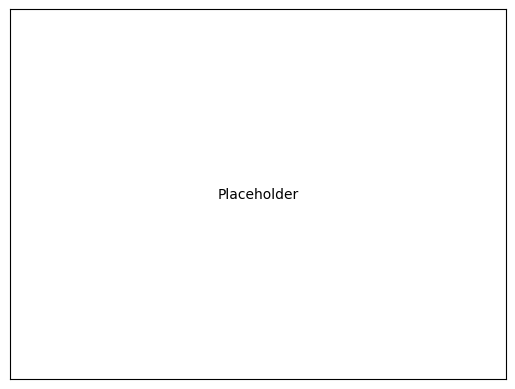
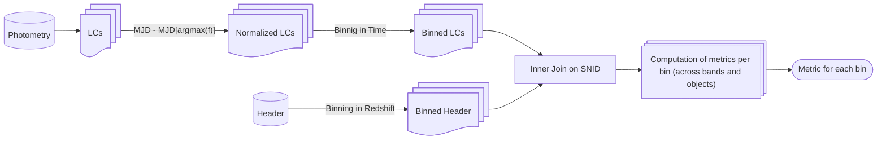

# Templates

* using these ensures that your markdown is also rendered correctly on [GitHub](https://github.com/)

## Styled Block-Quotes
* see [https://github.com/orgs/community/discussions/16925](https://github.com/orgs/community/discussions/16925) for source (last accessed 2025-06-02)

> [!NOTE]  
> Highlights information that users should take into account, even when skimming.

> [!TIP]
> Optional information to help a user be more successful.

> [!IMPORTANT]  
> Crucial information necessary for users to succeed.

> [!WARNING]  
> Critical content demanding immediate user attention due to potential risks.

> [!CAUTION]
> Negative potential consequences of an action.

## Cross-References

* labels are defined as follows (see source code):

* linking to some label can be done like so (see source):
[link](#lab-label)

## Figures

* we recommend
    * using tables for customizable panel layouts
    * using [Cross-References](#lab-crossreferences) for labelling (add label above table)
    * adding figures in table-content rows 
    * adding the label below the figure (to avoid formatting issues of the source code when viewed in VS-Code)
* an example can be found in [this example](#fig-label)

|||
|:-|:-|
|||

Your figure caption.

## Flowcharts

* it is recommended to use mermaid graphs
* an example can be found in [here](#fig-mermaidexample)
* for flowchart-elements consider the [documentation](https://mermaid.js.org/syntax/flowchart.html)

Your flowchart caption

## Math
* just use plain math (no fancy macros and stuff)
    * this ensures that the equations can be rendered across different platforms
* an example can be found in [here](#eq-distmod)

$$
\begin{align}
    \Delta m 
        &= m - M
        = 5\log_{10}\left(\frac{d\,[\mathrm{\mathrm{pc}}]}{10\,[\mathrm{pc}]}\right) + K_\mathrm{corr}
    ,
\end{align}
$$

## Iteration Formatting
* use $\LaTeX$ to color text consistently i.e.:
    * $\color{red}\text{TODO: your task }$

## Bibliography
* to already compile your bibliography at the time of summarizing make sure you obtain the relevant references and store them in a [bib-refs.bib](./report/bib-refs/bib-refs.bib) file
* for including references in your text I recommend just linking to [bib-refs.bib](./report/bib-refs/bib-refs.bib) and inserting the cite-key as the link-text like so: [Vaswani2017_TransformerAttention](./report/bib-refs/bib-refs.bib)

---
---

# Main Document

* all your actual content goes here (comment or delete [Templates](#sec-templates))
* we recommend structuring the readme already like a preliminary paper as then it's just a matter of copy-paste for writing the actual document

